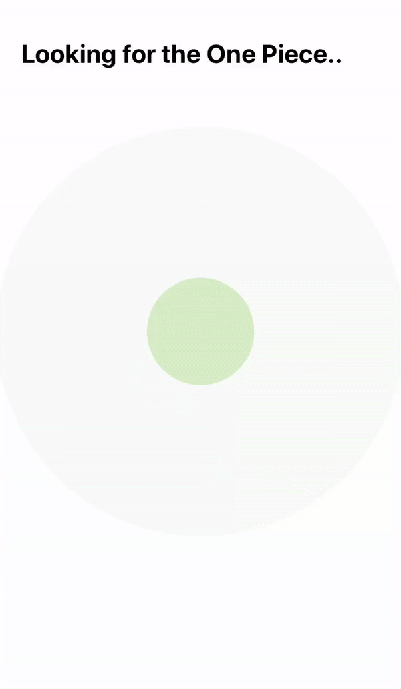

Animations challenges is actually pretty fun. It’s about picking a random animation in one of the app that we use everyday ( twitter, Facebook, Slack, others .. ) and try to recreate it together by doing Pair Programming.

## Bear Search

Pair Challenge with [John](https://twitter.com/JohnEstropia)
https://medium.com/eureka-engineering/animations-challenges-1-bear-ios-search-animation-7ea5e4ea0a34

## Twitter-Like favorite button

## Instagram stories progress bar

Pair Challenge with [Shima](https://twitter.com/shima_1212 )

## Asana Loader View

https://medium.com/eureka-engineering/animations-challenges-2-asana-loader-animation-c3a6d040f358

## Radar View

## Text and Animation

Pair Fun with [John](https://twitter.com/JohnEstropia)

